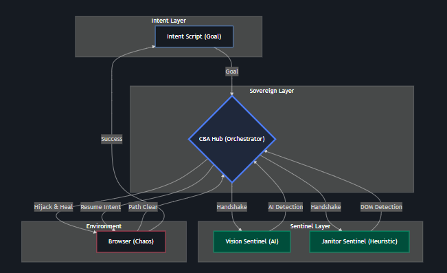

# 🛰️ Constellation-Based Automation (CBA)
## Starlight Protocol v2.5 — The Sovereign Agentic Era

**"Don't look at the ground; look at the Starlight."**

CBA is a philosophical shift in browser automation. Inspired by biological navigation (like the dung beetle using the Milky Way), this framework moves away from linear scripts that handle every possible UI obstacle. Instead, it uses a **Sovereign Constellation** of autonomous agents (Sentinels) that orient toward high-level goals.

## 🏗️ The Sovereign Constellation



CBA uses a **Decentralized Sidecar Architecture** communicating over a JSON-RPC message bus.

| Layer | Biological Equivalent | Role in CBA |
| :--- | :--- | :--- |
| **Intent Layer** | The Goal | High-level business intent. Now **Selector-Less** (e.g., `{ goal: 'Login' }`). |
| **The Hub** | The Brain | Orchestrates Playwright, resolves semantic goals, and manages the **Sovereign Context**. |
| **Vision (Sentinel)** | AI Perception | Uses local SLMs (Moondream) to visually detect and heal obstacles without selectors. |
| **Janitor (Sentinel)** | The Ground | Heuristic background process that clears modals, cookie banners, and overlays. |
| **Pulse (Sentinel)** | Entropy | Monitors network/DOM jitter to enforce **Wait-Less** temporal stability. |
| **Data (Sentinel)** | Intelligence | Passively extracts metadata (tokens, links) and injects it into the shared context. |

## 🛰️ The Starlight Protocol (v2.5)

Standardized signals for zero-wait, selector-less autonomy:

| Method | Initiator | Purpose |
| :--- | :--- | :--- |
| `starlight.intent` | Intent | Issues a high-level `goal` or `cmd`. |
| `starlight.pre_check` | Hub | Handshake broadcast with screenshot for **AI Vision** analysis. |
| `starlight.wait` | Sentinel | Veto due to environmental instability (Temporal Stability). |
| `starlight.hijack` | Sentinel | Request absolute browser lock for recovery/healing. |
| `starlight.context_update`| Sentinel | Inject intelligence into the Hub’s shared mission state. |

## 🛠️ The Starlight SDK (Python)
Build a sentinel in minutes using the provided base class:
```python
from sdk.starlight_sdk import SentinelBase

class MySentinel(SentinelBase):
    async def on_pre_check(self, params, msg_id):
        # Your custom healing logic here
        await self.send_clear()
```

## 📊 Visual Proof: Hero Story Reports
CBA generates a comprehensive `report.html` for every mission:
- **ROI Dashboard**: Automatically calculates minutes saved per automated intervention.
- **Sentinel Interventions**: Proof of work with "Before" and "After" screenshots of every healed obstacle.
- **Context Awareness**: Logs shared metadata discovered by the constellation.

## 🚀 Getting Started

### Prerequisites
- Node.js (v18+) & Python (3.9+)
- [Ollama](https://ollama.ai/) (for Vision Sentinel)
- Playwright

### Setup
```bash
git clone <repo-url>
npm install
pip install websockets httpx
npx playwright install chromium
```

### The "Full Constellation" Demo
Run the world-class **Cosmic Challenge** (Dynamic IDs, Jitter, Modals):
1. **Start Hub**: `node src/hub.js`
2. **Start Constellation**:
   - `python sentinels/pulse_sentinel.py`
   - `python sentinels/janitor.py`
   - `python sentinels/vision_sentinel.py`
   - `python sentinels/data_sentinel.py`
3. **Run Intent**: `node src/intent.js`

---
*Built with ❤️ by [Dhiraj Das](https://www.dhirajdas.dev)*
