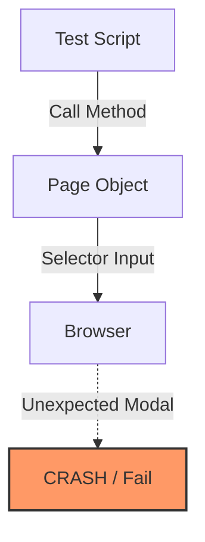
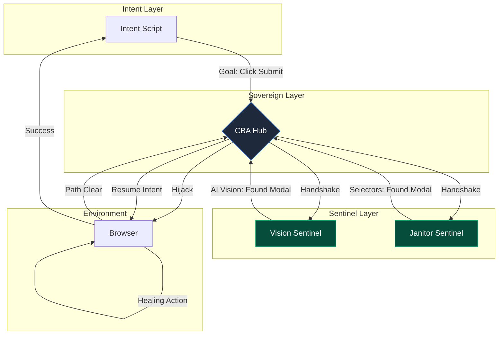

# CBA vs Traditional POM: Architectural Shift

This document outlines the fundamental shift from the linear **Page Object Model (POM)** to the non-linear, agentic **Constellation-Based Automation (CBA)**.

## 1. Traditional Page Object Model (POM)
In POM, the test script is tightly coupled to the UI structure through Page Objects. If an unexpected modal or UI change occurs, the test usually fails because the Page Object doesn't "know" how to handle the noise.

**Key Weakness:** The test logic must account for every possible UI state (modals, banners, loading states), leading to complex "if-else" logic in Page Objects.

---

## 2. Constellation-Based Automation (CBA)
CBA decouples **Intent** from **Environment**. The test only expresses a goal. A "Sentries" (Sentinels) monitor the environment and autonomously "heal" it before the intent is executed.

## Key Differences

| Feature | Page Object Model (POM) | Constellation-Based Automation (CBA) |
| :--- | :--- | :--- |
| **Logic Type** | Procedural / Linear | Reactive / Agentic |
| **Coupling** | High (Test knows UI) | Low (Intent is purely Business Goal) |
| **Error Handling** | Manual / Try-Catch | Autonomous (Sentinel Healing) |
| **AI Integration** | Difficult / Ad-hoc | Native (Vision Sentinels) |
| **Outcome** | "Flaky" on chaotic sites | "Stable" via Sovereign Remediation |

---

## Summary: The "Hero's Journey"
In CBA, the **Intent Layer** is the "Hero" who wants to reach a destination. The **Sentinels** are the "Guardians" who clear the path. The **Hub** is the "Map" that coordinates the journey. The Hero never has to worry about the obstacles—they are handled by the Guardians before the Hero even takes a step.
